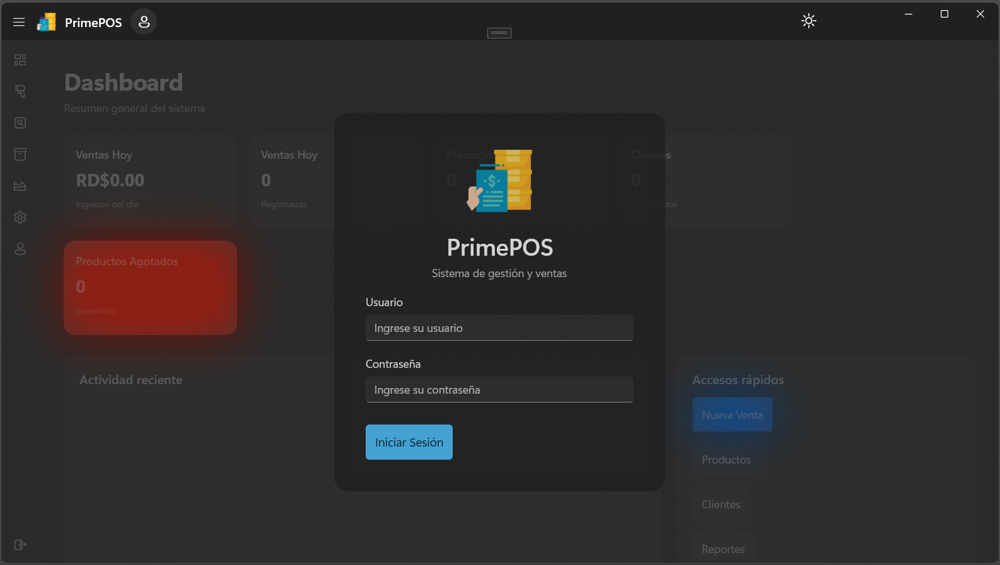
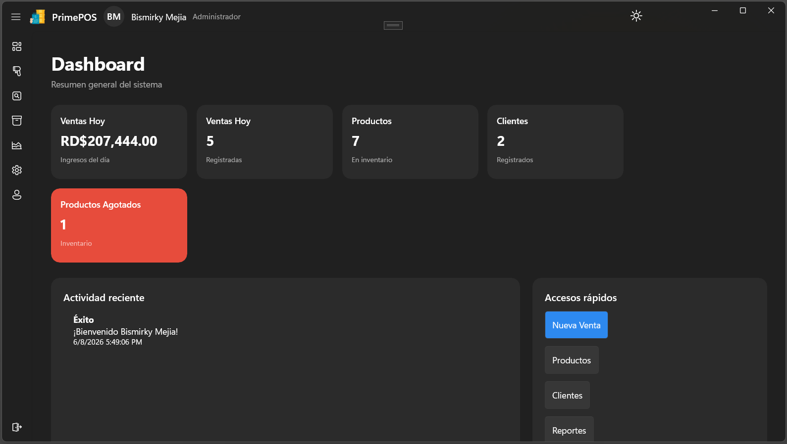
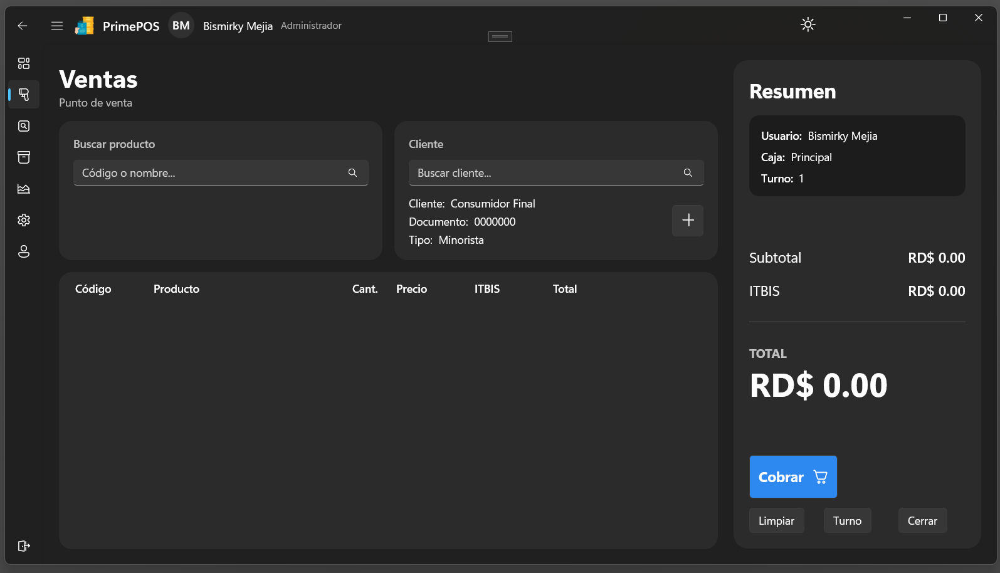
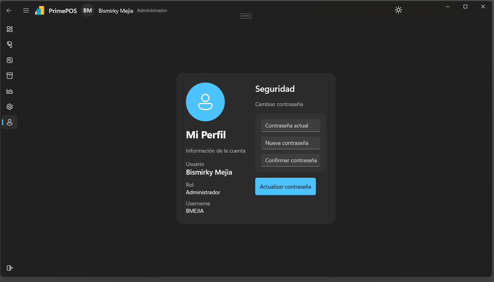
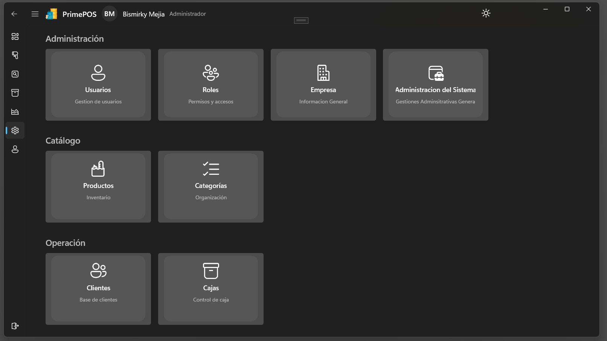

# PrimePOS 🧾

Sistema de Punto de Venta (POS) desarrollado con arquitectura moderna, enfocado en escalabilidad, mantenibilidad y buenas prácticas.

---

## 🚀 Tecnologías

- .NET 10
- WinUI 3
- ASP.NET Core Web API
- SQL Server
- JWT Authentication
- MVVM Toolkit

---

## 🧠 Arquitectura

El proyecto sigue una arquitectura en capas:

- **WinUI (Cliente)** → Interfaz de usuario con MVVM  
- **API REST** → Comunicación cliente-servidor  
- **BLL (Business Logic Layer)** → Lógica de negocio  
- **DAL (Data Access Layer)** → Acceso a datos  
- **ENTITIES (Entities Layer)** → Definición de entidades  
- **CONTRACTS (Contracts Layer)** → Definición de contratos  
- **Repository Pattern + Unit of Work**

---

## 🔥 Funcionalidades

- 🔐 Autenticación con JWT
- 🛒 Carrito de ventas dinámico
- 💸 Aplicación de descuentos
- 🧾 Generación de facturas
- 🧑‍💼 Gestión de clientes
- 📦 Gestión de productos
- 🏪 Manejo de cajas y turnos
- 📊 Cálculo automático de totales (impuestos, descuentos)

---

## 🖥️ Capturas de pantalla

### Login

### Dashboard

### Ventas

### Perfil

### Administracion

